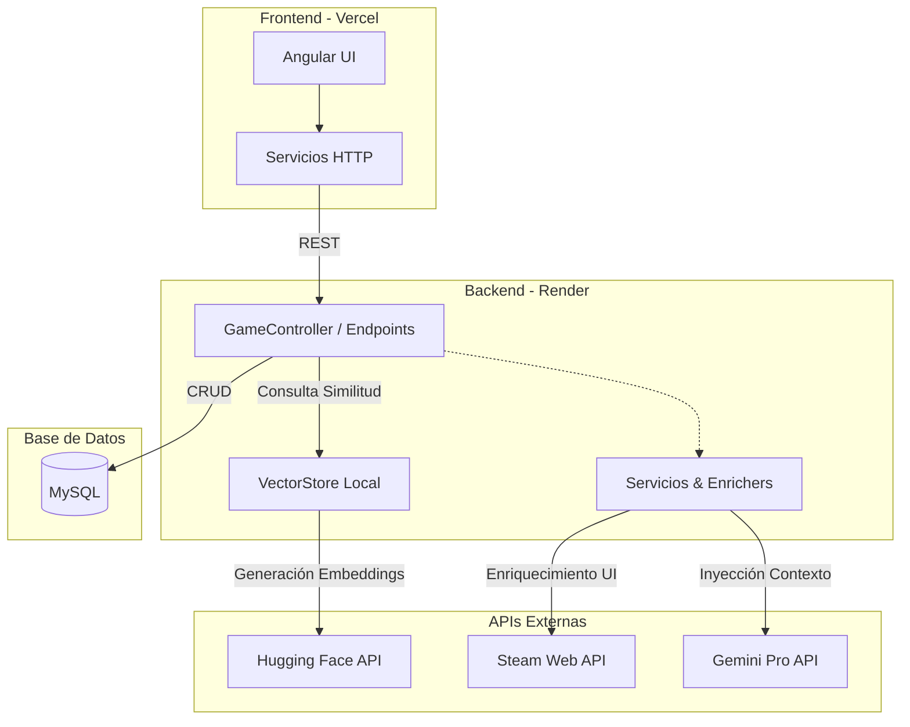

# 🎮 Game Collection Manager | Full-Stack project & Chatbot Integration

**[🔗 Ver Aplicación en Vivo](https://bootcamp-9hdgovmcp-pablo-navia5s-projects.vercel.app)**

> Nota: El código fuente se mantiene en un repositorio privado, pero la base de código completa está disponible para revisión técnica bajo petición.

---
## 💡 Acerca de la Aplicación
El sistema es un catálogo virtual completo (CRUD) que permite a los usuarios añadir, editar, visualizar y eliminar videojuegos, construido sobre una arquitectura distribuida. El frontend desarrollado en Angular consume una API REST alojada en Render, que a su vez persiste los datos en una base de datos MySQL en Aiven. Además de la gestión estándar del catálogo, el backend enriquece dinámicamente la información visual consumiendo la API de Steam e integra un chatbot inteligente basado en un flujo RAG (Retrieval-Augmented Generation) para ofrecer respuestas basadas en el inventario actual.

## 🛠 Stack Tecnológico
*   **Frontend:** Angular, TypeScript, Vercel.
*   **Backend:** Java 21, Spring Boot 4.0.3, Render.
*   **Base de Datos:** MySQL (Aiven).
*   **IA & Integraciones:** Gemini Pro API (LLM), Hugging Face (Embeddings), Steam Web API.

## 🏗 Arquitectura del Sistema


## 📸 Galería del Proyecto

<div align="center">
  
  &nbsp;&nbsp;&nbsp;&nbsp;
  
  <br><br><br>
  
  &nbsp;&nbsp;&nbsp;&nbsp;
  
</div>

## 📂 Estructura del Código

### Frontend (Angular)
La arquitectura del cliente sigue un diseño modular dividido por dominios (features) para escalar la aplicación sin acoplamiento
``` text
src/
├── app/
│   ├── app.component.ts
│   ├── app.config.ts
│   ├── app.routes.ts
│   ├── core/
│   │   └── services
│   ├── features/
│   │   └── game/
│   │       ├── adapters
│   │       ├── models
│   │       ├── resolvers
│   │       ├── pages/
│   │       │   ├── list-page/
│   │       │   │   ├── game-list-page.component.ts
│   │       │   │   ├── game-list-page.component.html
│   │       │   │   ├── game-list-page.component.scss
│   │       │   │   └── components/
│   │       │   │       └── list/
│   │       │   │           ├── game-list.component.ts
│   │       │   │           ├── game-list.component.html
│   │       │   │           ├── game-list.component.scss
│   │       │   │           └── components/
│   │       │   │               └── list-item/
│   │       │   │                   ├── game-list-item.component.ts
│   │       │   │                   ├── game-list-item.component.html
│   │       │   │                   └── game-list-item.component.scss
│   │       │   └── detail-page
│   │       ├── routes
│   │       ├── services
│   │       └── store
│   ├── pages/
│   │   ├── not-found
│   │   ├── forbidden
│   │   └── maintenance
│   └── shared/
│       ├── pipes
│       ├── directives
│       └── utils
└── assets
```

### Backend (Spring Boot)
El servidor implementa una arquitectura en capas estricta, separando la infraestructura, la lógica de negocio y la exposición de datos mediante el patrón Facade:
``` text
src/
├── main/
│   ├── config            
│   ├── controllers       
│   ├── converters        
│   ├── daos             
│   ├── dtos             
│   ├── enrichers         
│   ├── facades
│       └── impl           
│   ├── models            
│   └── services
│       └── impl         
└── resources/            
```

## 🚀 Funcionalidades Principales
*   **Gestión Integral del Catálogo (CRUD):** Operaciones completas de creación, lectura, edición y eliminación de videojuegos, con persistencia en una base de datos MySQL.
*   **Asistente IA:** Chatbot impulsado por Gemini API que genera respuestas precisas inyectando el inventario actual de la base de datos como contexto dinámico.
*   **Enriquecimiento de UI en Tiempo Real:** Integración directa con Steam Web API para poblar la interfaz gráfica automáticamente con banners, galerías de capturas y noticias actualizadas de cada título.

## 🧠 Retos Técnicos Superados
*   **Optimización de Memoria Cloud:** El motor local de *embeddings* excedía el límite de 512 MB de RAM de Render. La arquitectura se refactorizó delegando el cálculo vectorial a la API de Hugging Face mediante clientes HTTP, reduciendo el consumo del servidor a ~250 MB.
*   **Evasión de Firewalls y Estrategia Fallback:** Implementación de cabeceras `User-Agent` personalizadas para sortear los bloqueos de Cloudflare al interactuar con APIs externas desde IPs de centros de datos. Se diseñó un mecanismo de rescate para garantizar el 100% de disponibilidad gráfica y funcional en el frontend cuando Steam o Hugging Face aplican *rate limiting*.
*   **Configuración Estricta de CORS y Seguridad:** Resolución de bloqueos de políticas de mismo origen al separar el frontend (Vercel) del backend (Render). Se configuró un filtro CORS robusto en Spring Boot para autorizar dominios específicos de producción y gestionar correctamente las peticiones del cliente de Angular.
*   **Gestión Segura de Entornos y Credenciales:** Transición fluida de un entorno de desarrollo local a una arquitectura cloud. Se implementó la inyección de variables de entorno para proteger claves sensibles (Gemini API, Hugging Face, credenciales de Aiven) y se utilizaron los `environments` de Angular para dinamizar los endpoints de consumo según el despliegue.

## 👤 Autor
*   Pablo Navia - Desarrollador de aplicaciones multiplataforma.
*   [Linkedin](https://www.linkedin.com/in/pablo-navia5) 
